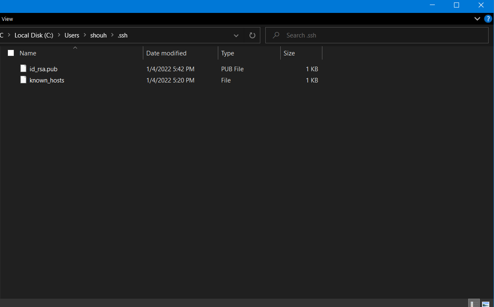

# Remote SSH Connection Tutorial
- By Hanzen Shou

This article is about connecting to a remote server from your PC's terminal using a Secure SHell (SSH) connection. 
With SSH, you can do everything you'd want to do on the server, from the comfort of your own home. 
You will send commands to the server, and after the server is done executing those commands, it will send the output text back like what any computer terminal does.

# Step 1: Install VSCode
This isn't really necessary but this tutorial will be using the Shell (terminal) that VSCode comes with.
Go to here (https://code.visualstudio.com/download) to download VSCode.

# Step 2: Remotely Connecting
First, you need to install OpenSSH. Use the following tutorial from everybody's good friend Microsoft: https://docs.microsoft.com/en-us/windows-server/administration/openssh/openssh_install_firstuse

Then, open up VSCode and open its built in terminal from "Terminal -> New Terminal"

Type in the following command into the terminal:
> ssh cs15lwi22**ABC**@ieng6.ucsd.edu
Instead of **ABC**, type whatever your account name is. You can find the appropriate name on UCSD's ETS Account Lookup Tool (https://sdacs.ucsd.edu/~icc/index.php).

Hit enter and login using your account password. **You need to 'reset' your password on the ETS Account Lookup Tool in order to activate the account.**
Your password will not appear in the box while typing, so try not to make any typos.

Once logged in, the server will send some status info that looks like this:

# Step 3: Trying some commands
Useful and fundamental commands include:
> cd (change directory)
> ls (list)
> cp (copy)
> cat (concatenate)
**cd** is used to move around the file hierarchy
**list** shows directory contents and details
**copy** copies files and directories
**cat** prints file contents

For more details, type the command followed by -help, like **ls --help**

# Step 4: Moving files with scp
With scp, you can send files over the SSH connection into the server from your client.
First, type `exit` and hit enter to return to your client's terminal session. Everything you do from here will be ran on your own computer, not the server.
Find a small file worth copying. Let's say it is a text file named "text.txt" The command you want to run is as follows:
> scp text.txt cs15lwi22**ABC**@ieng6.ucsd.edu:~/

**scp** takes two arguments: the name of the file to be copied and the destination. The :~/ at the end of the destination statement is to specify the home directory.
[scp command](scp_command.png)

# Setting an SSH Key
Logging in is annoying, so we can automate login procedures (like inputting passwords) with SSH keys. We will be generating RSA private-public key pairs and giving the public key to the server to this end.

Begin by executing `ssh-keygen` in your **client** terminal.
Then, go to C:/Users/your_user/.ssh/ to find your private and public keys.

My private key is not in the folder because I hid it, but yours should be present.
Then, copy the public key into the server's .ssh folder. If this folder does not exist, you may need to ssh in and use **mkdir** to create one.
The command is as follows:
> scp C:/Users/your_user/.ssh/id_rsa.pub cs15lwi22**ABC**@ieng6.ucsd.edu:~/.ssh/

Now you should be able to login without needing to type your password.

# Optimizing Remote Running
SSHing in and out is slow. Instead, you can send commands while staying in your client environment by sending the following:
> ssh cs15lwi22**ABC**@ieng6.ucsd.edu "whatever command"
> ssh cs15lwi22**ABC**@ieng6.ucsd.edu "ls"

You can also send multiple commands in one line by separating them with semicolons
> ls -a; cd .ssh; ls

By now, you should be basically familiar with SSH and how useful it is. Enjoy having to work from home too. There is no escape. :)
