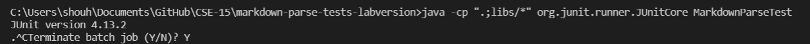
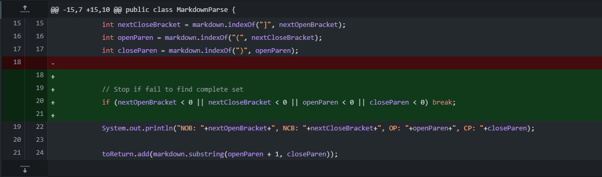
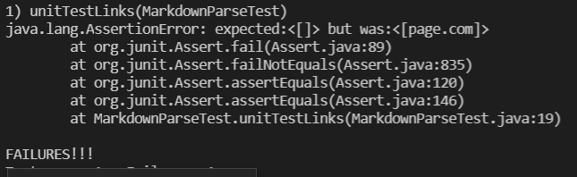
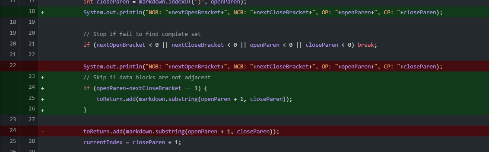
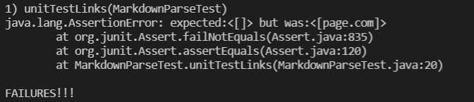
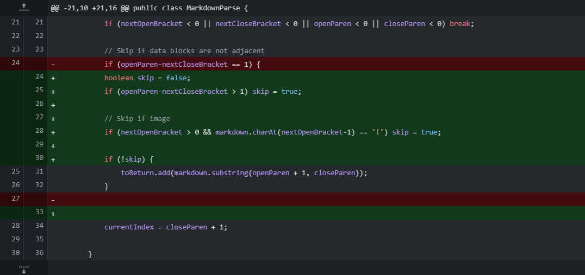

# Bugfix Galore

My Git history was messed up so I had to redo my group's bugfixes in a new repo.

# Bug 1
Symptom:\

Bugfix:\

Test file:
[test-file2.md](https://github.com/ucsd-cse15l-w22/markdown-parse/blob/main/test-file2.md)

The program was not quitting when discovering the final link if there was still text left in the file. This was because the exit condition expected the search index to go out of bounds, but the behavior of the program led to looping the search index. This was because indexOf returns -1 when not being able to find the given substring. To fix this error, I just checked if any of the indexOf searches failed.

# Bug 2
Symptom:\

Bugfix:\

Test file:
[test-file5.md](https://github.com/ucsd-cse15l-w22/markdown-parse/blob/main/test-file5.md)

The program was grouping together disjoint data blocks. To fix this, we instructed it to check if the data blocks are adjacent and if not, skip adding the entry. Does this create bugs where lonely square bracket blocks are censoring later links? Yes. Did we fix that? No.

# Bug 3
Symptom:\

Bugfix:\

Test file:
[test-file6.md](https://github.com/ucsd-cse15l-w22/markdown-parse/blob/main/test-file6.md)

The program incorrectly interpreted images and links. To prevent this, we checked if the square bracket block is preceded by an exclamation mark to see if the link should be registered or not. We also check if the square bracket block is at the start of the file, not checking for an exlamation mark if so to avoid an index out of bounds exception.
