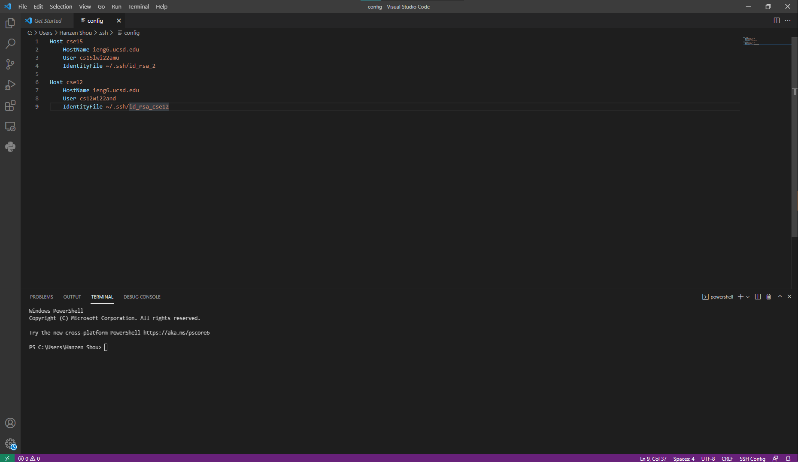
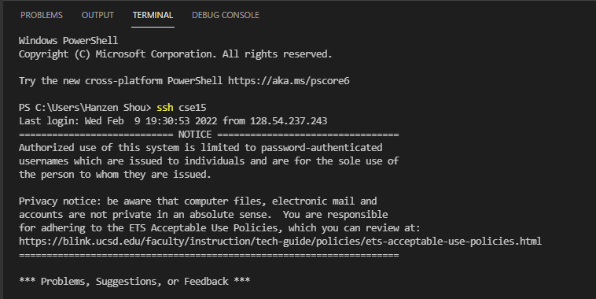
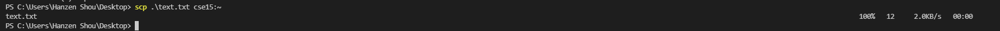

# Speeding Up SSH
Today we will be configuring our config file to speed up the SSH process.


The config file being edited exists in the .ssh folder. I am editing it with VSCode. For every alias entry, I am specifying the host name, user, and the private key that corresponds to the public key stored on the server.<br>


Here, you can see that I can enter the alias instead of the full host user combination to login. This enables me to work much faster and punch in the aliases by memory, instead of having to reference a document or the UCSD credentials website when I want to login.\


The alias also works with the ```scp``` command, letting me copy files in without having to punch in the full host user combination. Again, this can help speed up your workflow.\
