# Extra Testing
My repository: [link](https://github.com/D0rkKnight/markdown-parse-tests-labversion)\
The reviewed Repository: [link](https://github.com/ucsd-cse15l-w22/markdown-parse)\
Below contains information on every test and test result

&nbsp;

# Snippet 1
My test:
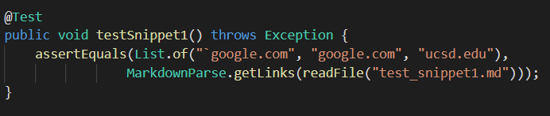

Reviewed test:
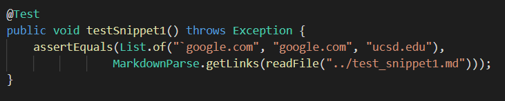

My code failed:
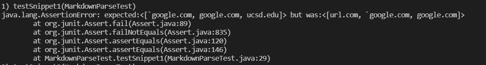

Reviewed code failed:
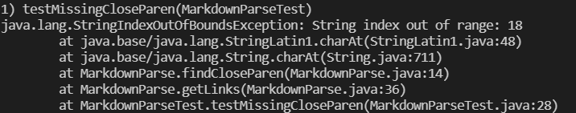

# Snippet 2
My test:
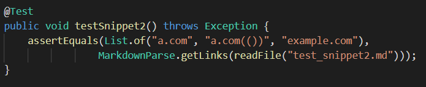

Reviewed test:
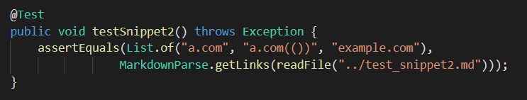

My code failed:
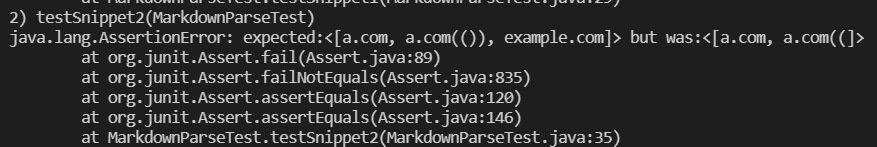

Reviewed code failed:
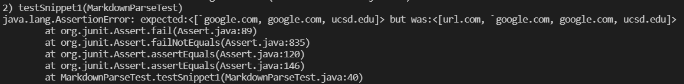

# Snippet 3
My test:
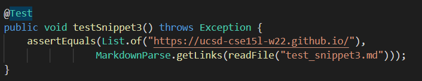

Reviewed test:
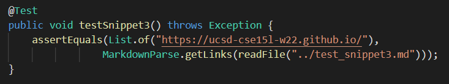

My code failed:
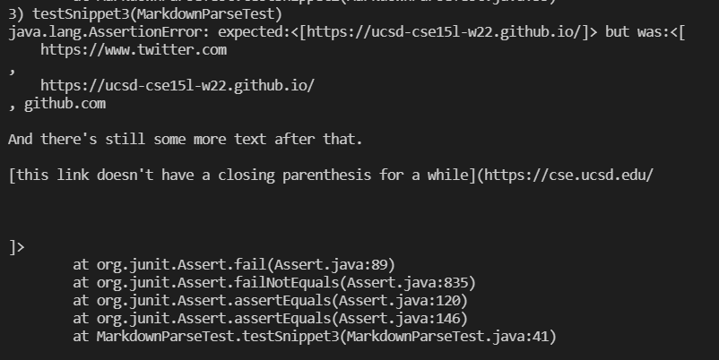

Reviewed code failed:
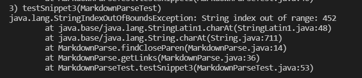

# Potential Solutions
<b>Snippet 1: </b> I can create a String processor that iterates through the string and cuts out code blocks marked by backticks. While this will be towing the line on the 10 line edit limit, I believe this to be a better solution than checking if key symbols are bounded by backticks.

<b> Snippet 2: </b> I see no simple solution, if I was tasked with fixing it, I'd probably write a parantheses counter that is aware of how many layers of parantheses are encapsulating the iterator at any given time. This is likely the best solution because semantic knowledge of parantheses pairs is necessary to correctly identify the link "a.com(())".

<b> Snippet 3: </b> I would both trim newlines in discovered links and exclude square bracket and parantheses pairs that have adjacent newlines. This will both create the proper output for "https://ucsd-cse15l-w22.github.io/" and exclude the other false links.