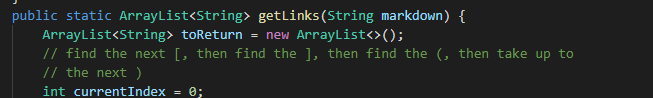
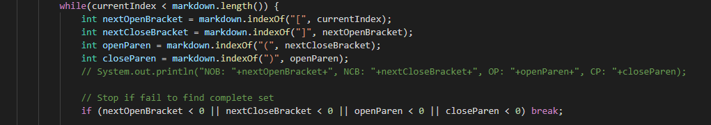

# Bugfix Ideas

I found the tests with different results through using a bash file to run every input for both instances of MarkdownParse and stream the output into respective output files. I then called `diff` on both output files to see where their outputs differed.

# Bugfix 1: Test File 494
Input:\
`[link](\(foo\))`

Expected output:\
`[(foo)]`

My Code's output:
`[\(foo\]`

Public Repo output:
`[\(foo\)]`

Neither implementation is correct. Since my code is actually exhibiting two bugs, I will fix just the one bug in the public repo.

The issue is that the program is not processing backslash escapes. For example, `\(` and `\)` should be considered by the program as just `(` and `)`.

The solution is to introduce a pass that resolves backslash escapes before the while loop in `getLinks()`. Since this specific test file does not involve any strange backslash escapes, we can remove most backslashes and either ignore the backslash in newlines or replace `\n` with some unique "skip code" that tells the program to skip later when searching for links.

The code fix should go here:\

# Bugfix 2: Test File
Input:\
`[link](foo(and(bar)))`

Expected output:\
`[foo(and(bar))]`

My Code's output:
`[foo(and(bar]`

Public Repo output:
`[foo(and(bar))]`

The public repo is correct. The issue with my implementation is that it does not pair up the parantheses, and thus ends the link at the first closing parantheses.

The solution is to count how many parantheses pairs wrap the pointer of the search loop in `getLinks()` at any given point and to use that information to end the link appropriately.

The code fix should go here:\
